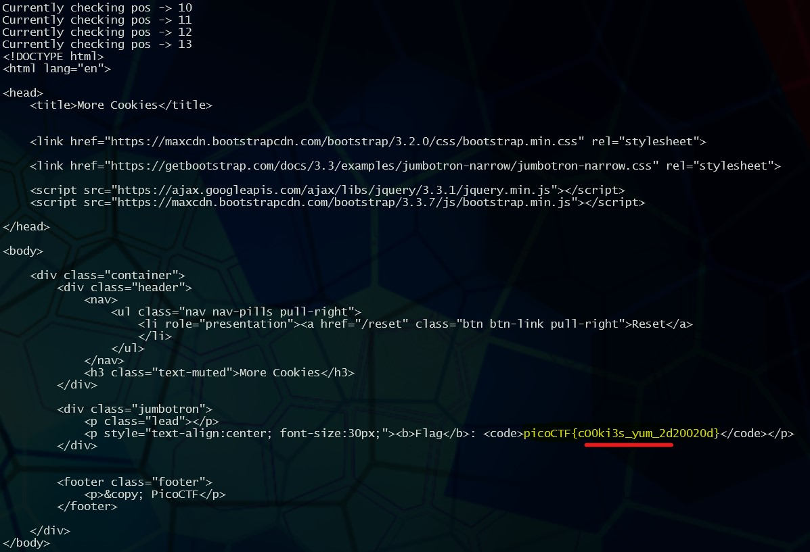

# picoCTF More Cookies

This challenge asks the user to access the given webpage as an administrator.

* The hints given point to homomorphic encryption which is a method of encryption that allows a user to modify encrypted data without having to first decrypt the data.
* The encyrpted data provided by this challenge is in the form of an encrypted cookie

```json
Cookie Value:

RW1WOG1RYnF1dUZYY204b0RRQkEwYWM4dVhSb1Ryc25VVDhKRUcyd3c1N0FESDZlOEpDOGhvbWUwSlB0UXRXcG9Od0k0bDdxV3R0VXhsT2tGZDY3dEpmbEFQdVRPbnlDMzMyTGlXOUhzemJkL1l5SDk2QTltRjNjN2xaN3d6QzA=
```

* When looking at the cookie value you can identify that it is encrypted using base64
* The cookie is also named `auth_name` so it is fair to say that when `auth_name` is `=0`, the user will not be able to access the webpage. We need to have `auth_name=1`.

* In the description of the CTF challenge there is also the hint of CBC standing out

> I forgot **C**ookies can **B**e modified **C**lient-side, so now I decided to encrypt them!

After searching for CBC within the scope of cyrptology, I found Cipher Block Chain and learned that it can be compromised using a bitflip attack to force `auth_name=1` and grant access to the webpage as an administrator.

To do this, I searched for bitflip attack examples due to this being a new concept that I was trying to tackle for the first time. While searching I found a great step by step guide on [youtube](https://www.youtube.com/watch?v=i9KiOjeE-VY) that I referenced to be able to solve the problem and to reveal the flag.

___

* The below screen capture shows the resulting web request printed in the terminal when the correct bit is flipped to enable `auth_name=1`


